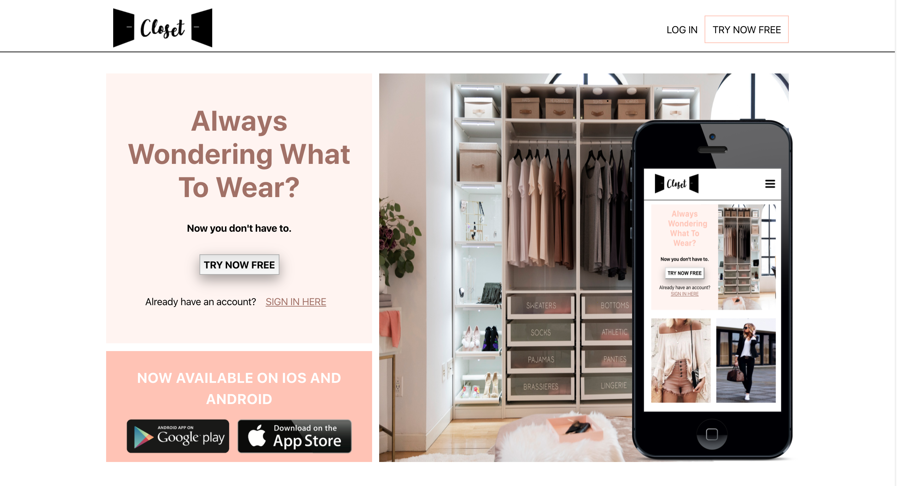
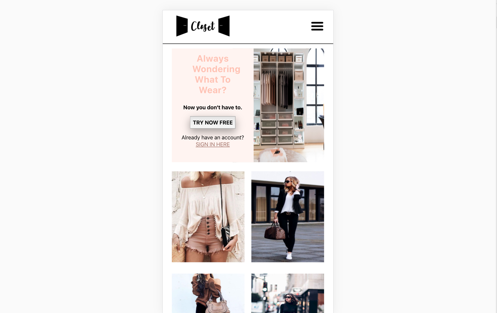
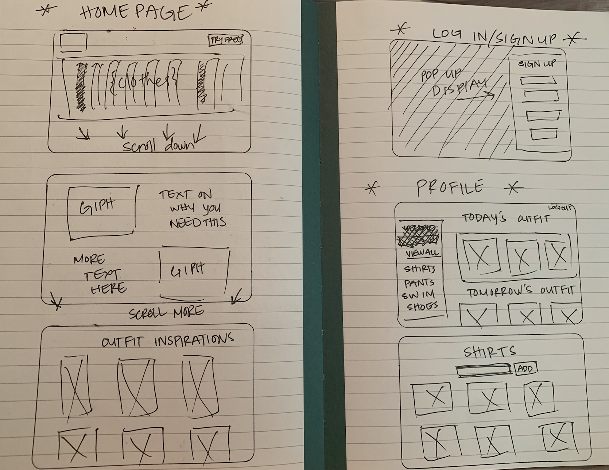
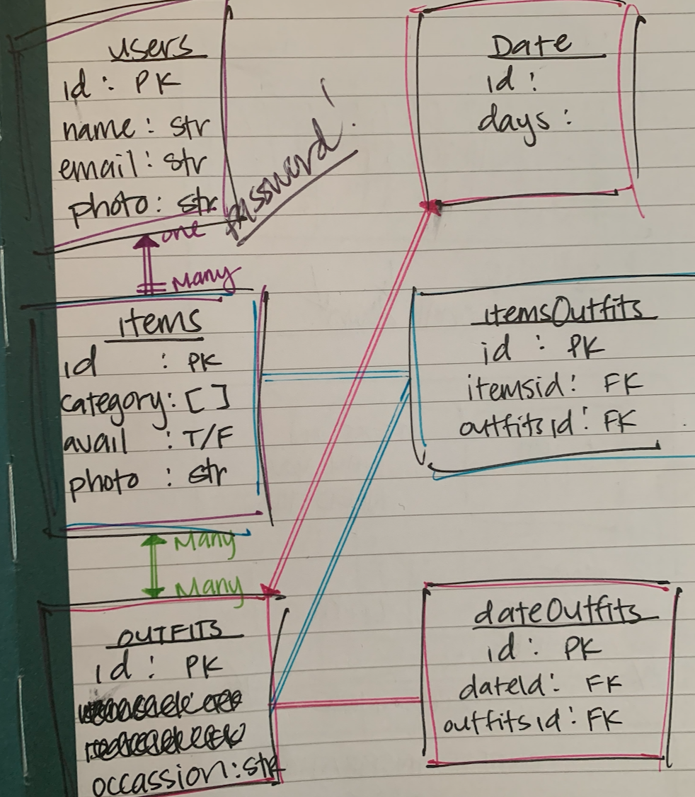

# Closet
App allowing users to upload photos of items in their closet so they can know what’s clean and readily available and what’s not, taking away that extra hassle of deciding what to wear in the morning.

## User Story
User looking for a way to look through their closet and plan out what they’ll wear throughout the week with the ease of a simple swipe. Being able to sort through your clothes by color, style, occasion quickly and being able to purge or know when something is in the wash or not without tearing up your entire room.

## Wireframes

## Proposed Architecture
-Backend with Flask
-Authentication - using oAuth in Python
-Frontend with HTML/CSS - utilizing key frames and animations, also want to make it mobile friendly

## MVP
- Getting routes up with Flask
- User can log on with auth
- Ability to upload photos
- Be able to see all your items 

## Stretch Goals
- Being able to sort by color, style, occasion and whether something is being washed or not
- Have a function on site where you can access your camera on your phone to upload more photos
- Showcase other users outfits that theyve put together as inspiration

## Road Blocks
I struggled so hard with auth...
I got really stuck on how to even implement it and at the end a user and can log in and sign up, but when you go on the profile it still says that there in an invalid token...